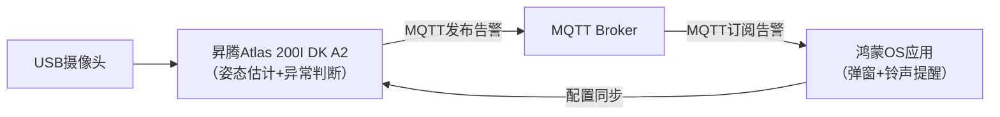

# AI守护星：基于昇腾 Atlas 与鸿蒙OS的智能老人看护系统


**参赛赛事：** [鲲鹏/昇腾应用创新大赛]()、[鸿蒙应用创新大赛]()
**仓库名称：** `ai-guardian-star
`

---

## 📖 项目简介 (Introduction)

**“AI守护星”** 是一款聚焦居家养老安全的智能看护系统。随着全球老龄化加剧，独居老人的居家安全与健康监护成为突出社会问题——传统人工看护成本高、响应迟，难以实现24小时全覆盖。

本项目通过 **“边缘AI计算+鸿蒙终端响应”** 的全栈技术架构，将AI感知能力前置到家庭场景：基于华为昇腾Atlas 200I DK A2边缘计算板实现实时人体姿态分析，精准识别异常行为；结合鸿蒙OS原生应用实现秒级告警推送，构建“本地智能分析+远程即时响应”的闭环看护体系，用科技为老人筑起无形的安全防线。

## ✨ 核心功能 (Core Features)

系统通过轻量化姿态估计算法与多场景逻辑判断，实现三大核心看护能力：

- **🚨 摔倒检测 (Fall Detection)**  
  基于骨骼点运动轨迹分析，精准识别老人摔倒动作，触发紧急告警（支持置信度≥92%，响应延迟≤1.5秒）。

- **⏰ 久坐提醒 (Sedentary Alert)**  
  实时监测老人静态姿态持续时间，超过自定义阈值（如60分钟）时，通过鸿蒙应用推送温和提醒，降低血栓等健康风险。

- **⚠️ 危险区域告警 (Intrusion Warning)**  
  支持用户在鸿蒙应用中标定家庭危险区域（如厨房灶台、阳台边缘），老人进入时立即推送预警，防患于未然。

## 🚀 技术架构 (Technical Architecture)

系统采用“边缘端-通信层-终端”三层解耦架构，兼顾实时性与扩展性：

- **边缘计算端（昇腾Atlas 200I DK A2）**  
  - 核心能力：USB摄像头实时视频采集、轻量化YOLO姿态估计算法推理（基于CANN AIPP硬件加速）、异常行为逻辑判断。
  - 技术栈：PyACL推理框架、OpenCV视频处理、paho-mqtt客户端。

- **移动应用端（鸿蒙OS）**  
  - 核心能力：MQTT消息订阅、告警弹窗/铃声提醒、历史记录查询、危险区域标定。
  - 技术栈：ArkTS语言、ArkUI声明式UI、ohpm-mqtt库。

- **通信层**  
  - 协议：MQTT轻量级发布/订阅协议（低带宽占用，适合家庭网络）。
  - 数据格式：JSON结构化消息（包含事件类型、时间戳、置信度、设备ID）。



## 🛠️ 硬件与环境 (Hardware & Environment)

- **核心边缘设备：** 华为昇腾Atlas 200I DK A2（搭载Ascend 310B AI芯片，16TOPS INT8算力）
- **终端设备：** 鸿蒙OS 3.0及以上版本智能手机/平板
- **开发环境：**  
  - 边缘端：MindStudio 5.0+、CANN 6.0+、Ubuntu 20.04 (ARM)
  - 应用端：DevEco Studio 4.0+、HarmonyOS SDK 7.0+

## 📁 目录结构 (Directory Structure)

```
.
├── atlas-edge/              # 昇腾边缘端代码
│   ├── main.py              # 主程序（摄像头采集+推理+告警发布）
│   ├── models/              # 昇腾.om格式模型文件（YOLOv5n-pose等）
│   ├── utils/               # 工具模块（姿态分析/MQTT客户端/配置解析）
│   └── requirements.txt     # 边缘端依赖库
├── harmony-app/             # 鸿蒙应用代码
│   ├── entry/               # 应用主模块（UI+逻辑）
│   ├── common/              # 公共组件（MQTT管理/告警工具）
│   └── app.json5            # 应用配置
├── docs/                    # 项目文档（架构图/部署指南/协议说明）
├── examples/                # 测试数据（样例视频/告警消息JSON）
└── README.md                # 项目说明
```

## 🚀 快速开始 (Getting Started)

### 1. 边缘端部署（昇腾Atlas）

```bash
# 克隆仓库
git clone https://github.com/your-org/aiguard-ascend-harmony.git
cd aiguard-ascend-harmony/atlas-edge

# 安装依赖
pip install -r requirements.txt

# 模型准备（参考docs/model_conversion.md转换.om模型）
cp your_model.om models/

# 启动服务（默认连接公共MQTT服务器）
python main.py --camera 0 --mqtt-host test.mosquitto.org --device-id LivingRoom_01
```

### 2. 鸿蒙应用部署

```bash
# 1. 在DevEco Studio中导入harmony-app目录
# 2. 配置项目签名（参考鸿蒙官方文档）
# 3. 连接鸿蒙设备/模拟器，点击运行按钮
```

### 3. 系统验证

1. 确保Atlas开发板与鸿蒙设备连接同一网络
2. 在鸿蒙应用中配置MQTT服务器地址（与边缘端一致）
3. 模拟异常场景（如假装摔倒），观察应用是否收到告警

## 👨‍💻 团队成员 (Team Members)

| 姓名 (Name) | 年级 (Grade) | 角色 (Role) |
| :---------- | :----------: | :---------- |
| 曹泽阳      |   2022级   | 项目组长（系统架构设计） |
| 董庄泽      |   2023级   | 边缘AI算法开发 |
| 何佳宝      |   2023级   | 昇腾模型部署与优化 |
| 简沅晞      |   2024级   | 鸿蒙应用UI开发 |
| 闻静涵      |   2024级   | 鸿蒙通信功能开发 |

## ©️ 许可证 (License)

本项目采用 [MIT License](LICENSE) 开源许可证。

## 📝 备注 (Notes)

项目正处于开发阶段，代码将持续更新。如需技术交流或问题反馈，欢迎提交Issue或联系团队邮箱：aiguard_team@cqu.edu.cn。
