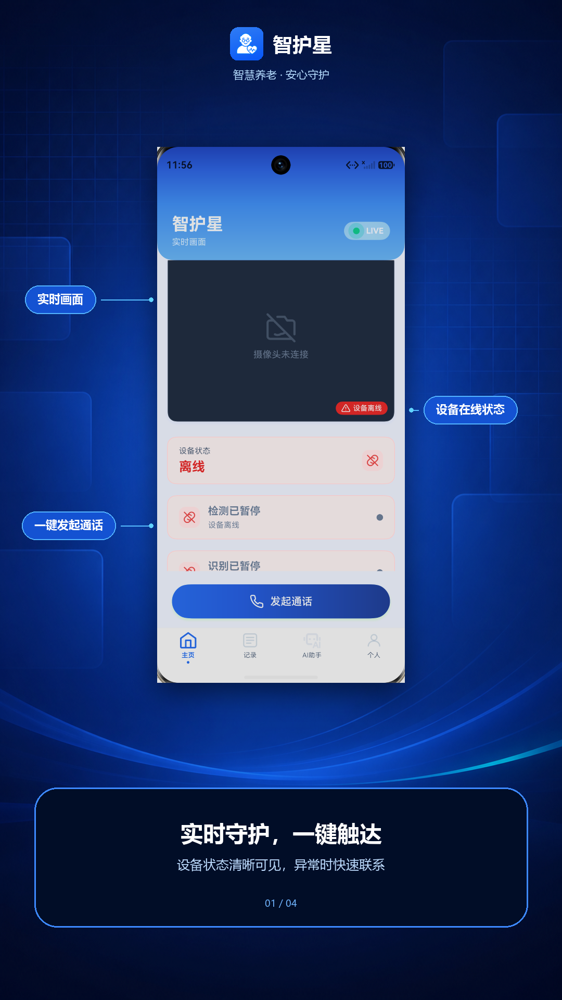
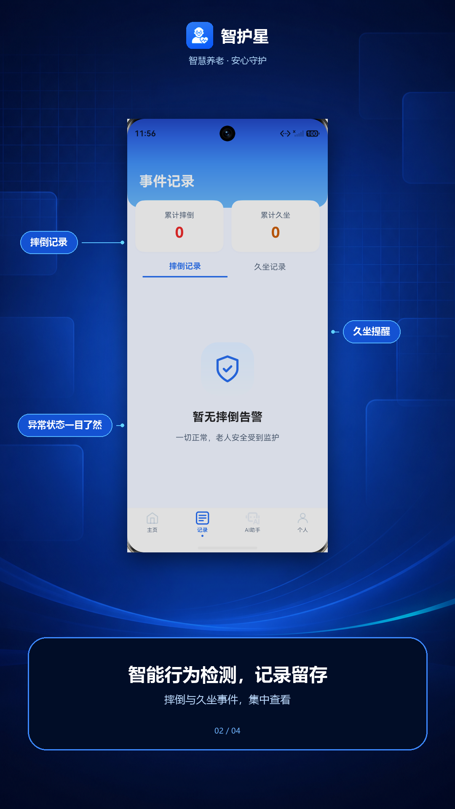
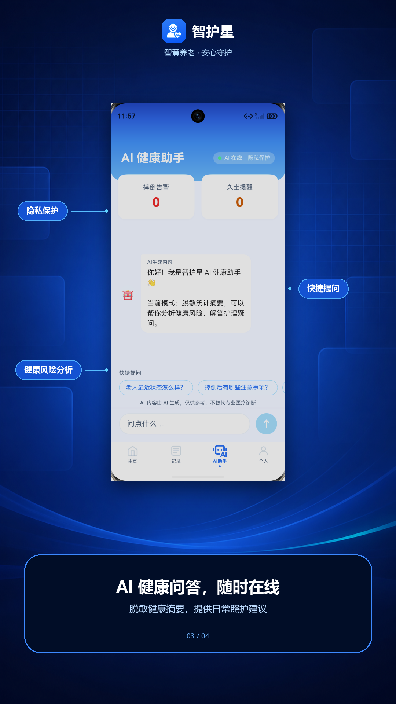
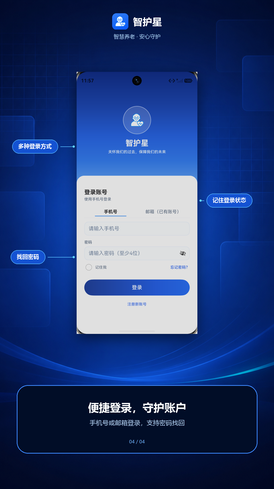

<div align="center">

# AI Guardian Star · 智护星

**An open-source edge–cloud–device elderly-care system built with HarmonyOS and edge AI.**<br />
**基于 HarmonyOS 与边缘 AI 的开源端—云—边居家照护系统。**

**English** · [中文](README.zh-CN.md)

[](https://github.com/zmuxuny/ai-guardian-star/actions/workflows/ci.yml)
[](https://developer.huawei.com/consumer/cn/harmonyos/)
[](https://flask.palletsprojects.com/)
[](https://github.com/zmuxuny/ai-guardian-star/releases)
[](LICENSE)

</div>

## Overview

**AI Guardian Star** is an open-source reference implementation for home elderly care that connects a native HarmonyOS application, a production-oriented cloud service, and independently deployed edge-AI devices.

The repository contains the **HarmonyOS client**, **account/session and AI gateway backend**, **deployment/operations tooling**, **security controls**, **automated tests**, and **CI/CD configuration**. Edge devices integrate with the system through MQTT, HTTP, and WebSocket interfaces. The edge-device inference implementation itself is deployed separately and is not included in this repository.

The project is designed around a practical end-to-end path:

**edge perception → secure event transport → cloud/account services → native HarmonyOS experience → caregiver-facing alerts and health records.**

The current public prerelease includes a deployable HarmonyOS HAP and an actively maintained backend. Core account flows have been validated on HarmonyOS API 23 devices.

## Screenshots

Captured on a HarmonyOS phone (1080 × 1920). The application also ships tablet layouts.

<table>
  <tr>
    <td align="center"><br /><sub><b>Live guardian</b><br />Device status and real-time alerts</sub></td>
    <td align="center"><br /><sub><b>Event records</b><br />Fall, sedentary and stranger history</sub></td>
    <td align="center"><br /><sub><b>AI health assistant</b><br />Three data-sharing levels</sub></td>
    <td align="center"><br /><sub><b>Secure sign-in</b><br />SMS registration and token sessions</sub></td>
  </tr>
</table>

## Why this project exists

Many elderly-care prototypes stop at a model demo or a single mobile interface. AI Guardian Star focuses on the integration work required to turn edge perception into a maintainable application system:

- native HarmonyOS phone/tablet client;
- secure cloud account and session management;
- edge-device event ingestion over MQTT TLS;
- local health-event persistence with ArkDB;
- AI health assistant with explicit data-sharing levels;
- content moderation around model input/output;
- video, face-enrollment, and voice communication integration points;
- deployment, monitoring, backup, security, CI, and regression testing.

It is intended both as an application and as a reusable engineering reference for developers exploring **HarmonyOS + edge AI + cloud services**.

## Architecture

<p align="center">
  
</p>

```text
┌──────────────────────── HarmonyOS App ────────────────────────┐
│ ArkUI · ArkDB · Asset Store · HTTPS · MQTT TLS · WebSocket   │
└──────────────────┬──────────────────────────┬─────────────────┘
                   │ HTTPS                    │ MQTT / HTTP / WS
                   ▼                          ▼
┌──────────────────────── Cloud Service ────────────────────────┐
│ Reverse Proxy / HTTPS → Flask                                 │
│ Accounts · Sessions · SQLite · AI Gateway · Moderation       │
│ Operations · Backup · Monitoring                             │
└───────────────────────────────────────────────────────────────┘
                                              ▲
                                              │
                                ┌─────────────┴─────────────┐
                                │ Independently deployed    │
                                │ edge-AI device            │
                                │ pose / video / face / IoT │
                                └───────────────────────────┘
```

## Key capabilities

### HarmonyOS client

- Native HarmonyOS 6.1 / API 23 application using ArkTS, ArkUI, and the Stage model.
- Responsive phone/tablet layouts and light/dark themes.
- Account profile, address, password, session, and local preference management.
- ArkDB persistence for health events, video metadata, settings, and local user data.
- Health-history views and event records.

### Authentication and security

- Short-lived access tokens and rotatable refresh tokens.
- Automatic token refresh on authenticated request failure.
- Refresh-token persistence in HarmonyOS Asset Store when “Remember me” is enabled; access tokens remain in memory.
- Server-side session revocation and logout support.
- SMS verification for registration and password recovery, with challenge validation and rate/cost controls.
- Password hashing and validation utilities on the backend.
- Administrative database access designed for SSH-tunnel-only operation instead of public exposure.

### Edge-device integration

- MQTT TLS event ingestion for fall, sedentary, stranger, normal, and unknown states.
- Device liveness tracking and alert-state recovery logic.
- Health events persisted into the application database.
- App-side integration points for video streams, face enrollment, and bidirectional WebSocket audio.

### AI health assistant

- Server-side AI gateway rather than embedding model credentials in the client.
- `basic`, `privacy`, and `full` data-sharing levels for contextual health assistance.
- Input and output moderation around AI requests.
- Health summaries built from application state instead of unrestricted raw-data forwarding.

### Engineering and operations

- GitHub Actions CI for Python regression tests, syntax checks, and diff validation.
- Optional self-hosted Windows runner for signed HarmonyOS Release HAP builds.
- Optional production deployment workflow for the backend.
- systemd-oriented production deployment examples.
- SQLite maintenance, backup, and monitoring utilities.
- Issue templates, PR template, security policy, contribution guide, changelog, and release artifacts.

## Current project status

| Area | Status | Notes |
|---|---|---|
| HarmonyOS login & account management | ✅ Validated | Login, profile, password, logout/session revocation, account deletion |
| Session security | ✅ Implemented | Access/refresh tokens, refresh rotation, server-side revocation |
| “Remember me” | ✅ Device-validated | Refresh token stored through Asset Store |
| SMS registration | ✅ Device-validated | Real SMS send / verify / registration flow |
| ArkDB local data | ✅ Implemented | Health events, settings, video metadata, local state |
| MQTT alerts | ✅ Integrated | TLS connection; real edge-device deployments still require environment-specific integration |
| AI health assistant | ✅ Integrated | AI gateway + three privacy levels + input/output moderation |
| CI / backend deployment | ✅ Implemented | Tests, optional HAP build, optional production deploy |
| Video / face / voice | 🚧 Integration stage | App interfaces exist; complete end-to-end validation depends on edge deployment |
| openGauss migration | 🧪 Evaluated | Production currently remains on SQLite |

## Repository layout

```text
ai-guardian-star/
├── AppScope/                       # HarmonyOS application-level configuration/resources
├── entry/                          # Main HarmonyOS module
│   └── src/main/ets/
│       ├── common/                 # Cloud, AI, MQTT, theme, session and audio services
│       ├── components/             # Reusable ArkUI components
│       ├── database/               # ArkDB data-access layer
│       └── pages/                  # Login, home, records, AI assistant, profile, etc.
├── deploy/                         # Production deployment / monitoring / maintenance tools
├── docs/                           # Security, SMS, moderation and database documentation
├── .github/                        # CI, issue templates and PR template
├── wenxin_proxy.py                 # Account/session + AI gateway backend
├── security_utils.py               # Password/security utilities
├── test_wenxin_proxy.py            # Backend regression tests
├── test_client_auth_contract.py    # Client/backend authentication contract tests
├── test_ops_monitor.py             # Operations monitoring tests
├── test_sqlite_maintenance.py      # SQLite maintenance tests
└── guardian_system_architecture.svg
```

For a deeper code map, see [PROJECT_STRUCTURE.md](PROJECT_STRUCTURE.md).

## Quick start

### Requirements

- DevEco Studio 6.0 or newer
- HarmonyOS SDK 6.1 / API 23
- Python 3.8+ for the backend and tests

### Build the HarmonyOS app

1. Clone the repository and open it with DevEco Studio.
2. Install HarmonyOS project dependencies.
3. Configure your own signing certificate and Profile for the `default` product.
4. Review the endpoint configuration in `entry/src/main/ets/config.ets` for your deployment.
5. Connect a HarmonyOS device and build/install the `default` product.

A Release HAP can also be built with DevEco Studio's Hvigor tooling:

```powershell
<DevEco-Studio>\tools\hvigor\bin\hvigorw.bat `
  --mode module `
  -p product=default `
  -p module=entry@default `
  -p buildMode=release `
  assembleHap --no-daemon
```

Never commit signing passwords, private keys, access keys, personal absolute paths, or production secrets.

### Run the backend

```bash
python3 -m venv .venv
. .venv/bin/activate
pip install -r requirements-production.txt
python wenxin_proxy.py
```

For production, run the Flask application behind an HTTPS reverse proxy and keep the application port bound to loopback. See the examples under [`deploy/`](deploy/) and the security documentation under [`docs/`](docs/).

### Run tests

```bash
python -m unittest discover -v
```

CI also runs Python compilation checks and diff validation. HarmonyOS Release HAP builds can be enabled on a configured self-hosted Windows runner.

## Releases

Published packages are available from [GitHub Releases](https://github.com/zmuxuny/ai-guardian-star/releases). `v0.1.0` is the most recent prerelease shipping an installable HarmonyOS HAP for device validation; `v0.2.0` was published as a source-only prerelease.

This repository is at version `0.2.1` (membership paywall removed, accessible color contrast, semantic color system, OTP-verified account deletion). Versions stay in the `0.x` range until the first store-approved release, which will be `1.0.0`. See [CHANGELOG.md](CHANGELOG.md) for the full history.

## Security

Security-sensitive configuration is injected through server environment variables and must not be embedded in the application or committed to the repository.

See:

- [SECURITY.md](SECURITY.md)
- [Security remediation notes](docs/security-remediation-2026-07-15.md)
- [Database administration access](docs/database-admin-access.md)
- [SMS registration setup](docs/aliyun-sms-registration-setup.md)
- [Content moderation setup](docs/aliyun-content-moderation-setup.md)

Please do **not** disclose suspected vulnerabilities in a public Issue before reading [SECURITY.md](SECURITY.md).

## Contributing

Contributions are welcome. Bug reports, documentation improvements, HarmonyOS compatibility fixes, backend hardening, edge-device adapters, tests, and deployment improvements are all useful.

Please read [CONTRIBUTING.md](CONTRIBUTING.md) and [CODE_OF_CONDUCT.md](CODE_OF_CONDUCT.md) before submitting changes.

## Roadmap

- [x] Real-device SMS registration verification
- [x] “Remember me” device validation
- [x] Secure database administration through SSH tunneling
- [x] Automated backend test workflow
- [x] Optional HarmonyOS Release HAP CI job
- [x] Optional production backend deployment workflow
- [ ] Complete broader real-device validation for refresh-token rotation
- [ ] Complete end-to-end video / face / voice integration with edge devices
- [ ] Run production migration and recovery drills for the database layer
- [ ] Expand reusable edge-device integration documentation and adapters

## Maintainers and contributors

| Name | Role |
|---|---|
| **Cao Zeyang (@zmuxuny)** | Project lead, architecture, backend/security and system integration |
| Jian Yuanxi | HarmonyOS application, communication, cloud sync and database |
| Dong Zhuangze | Edge-AI algorithms, deployment and optimization |
| He Jiabao | Edge-AI algorithms, dataset construction and annotation |
| Wen Jinghan | Requirements, product design and user testing |

## License

Licensed under the [Apache License 2.0](LICENSE).
