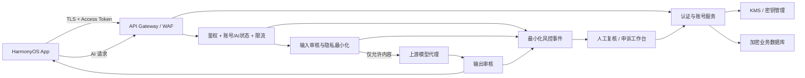

# 智护星 App 安全评估整改方案（截至 2026-07-15）

> 文档状态：整改基线 v1.0。本文是工程整改方案，不替代律师意见、主管部门书面意见或平台审核结论。涉及“实名制”的最终适用范围，以公安、网信等主管部门针对本产品业务形态的明确要求为准。
>
> 2026-07-03 发布的《互联网信息服务管理办法（修订草案征求意见稿）》仍是**征求意见稿**，本文只把它作为前瞻性设计参考，不把它当作现行生效规则。

## 1. 结论与整改目标

本轮整改应同时解决四件事：

1. 以**服务端核验成功的手机号**作为基础账号注册路径；移除邮箱独立注册，邮箱仅作为登录后可选联系地址，并通过邮件验证码绑定。
2. 把身份、密码、会话和资料处理从“客户端自证 + 明文存储”改为“服务端鉴权 + 分层加密 + 最小留存”。
3. 在每次 AI 请求到达共享上游模型前完成用户鉴权、账号状态检查、限流和输入风控，并在返回客户端前进行输出风控，避免单个用户滥用扩大为整个上游项目或密钥被停用。
4. 建立可执行的账号处置、通知、人工复核和申诉闭环；对一般 AI 滥用优先限制 AI 功能，不把整个照护账号一刀切封禁。

当前版本不具备上线所需的最低安全基线。必须先完成 P0 止血项，再继续新增登录渠道或扩大测试用户。

## 2. “手机号核验”“第三方登录”和“身份证实名”的边界

### 2.1 三个概念不能混用

| 概念 | 技术上能证明什么 | 不能自动证明什么 | 本项目口径 |
| --- | --- | --- | --- |
| 手机号核验 | 用户在本次操作中能够接收该号码的短信验证码，证明对号码的当前控制 | 不能直接证明姓名、身份证号，也不能排除借用、转售或被接管号码 | 依据本次公安评估口径，作为本项目基础注册/真实身份信息认证路径；必须真实发送并服务端核验 OTP，不能只校验 11 位格式 |
| 第三方账号登录 | 用户控制某个华为、微信、QQ 或支付宝账号；服务端可取得稳定平台主体标识 | 普通 OAuth 登录不当然向本项目证明手机号，也不当然等于身份证实名 | 没有取得并服务端验证“已核验手机号”的渠道，首次登录后仍须绑定短信核验手机号 |
| 身份证实名 | 通过依法合规的身份核验渠道验证姓名、证件号码等真实身份信息 | 不应因为“以后可能需要”就提前收集证件照片或人脸 | 当前不默认建设；只有主管部门明确要求且完成个人信息保护评估后再单独立项 |

现行《移动互联网应用程序信息服务管理规定》第六条，以及《互联网用户账号信息管理规定》第九条，均使用“基于移动电话号码、身份证件号码或者统一社会信用代码等方式的真实身份信息认证”这一表述。工程上至少要保留可审计的手机号发送、校验、消费和绑定证据。**当前应用只接受任意格式正确的号码且跳过验证码，既没有证明号码控制权，也不能作为手机号核验完成的证据。**

### 2.2 本项目注册规则

- 新用户主路径：手机号 -> 发送验证码 -> 服务端校验一次性验证码 -> 创建账号 -> 签发会话。
- 邮箱：从注册页删除；仅在登录后由用户自愿绑定，发送邮件验证码验证。未绑定邮箱不影响基本功能。
- 第三方登录：平台回调验证完成后，若该渠道没有返回并由服务端验证可采信的手机号，则进入 `pending_phone_verification`，完成短信绑定后才激活需要真实身份信息认证的服务。
- 存量邮箱账号：保留数据，首次升级登录后要求绑定手机号；迁移窗口内只能访问账号迁移、资料导出、申诉等必要页面，不可调用 AI 或发布信息。
- 手机号更换：必须验证新号码；高风险情况下同时验证旧号码或进行人工申诉，不允许普通资料更新接口直接修改。
- 账号删除后重注册、异常设备、频繁换号等场景，进入动态复核或人工审查，不在客户端本地判断。

## 3. 当前 P0/P1 证据与风险

下表基于本轮整改开始前的 2026-07-15 代码快照。行号用于定位，后续代码变化时应以 Git 历史复核。

| 等级 | 当前证据 | 风险 | 立即动作 |
| --- | --- | --- | --- |
| P0 | `entry/src/main/ets/pages/Login.ets:669-748,839-874`：密码直接传输/保存；云端失败会进入注册；验证码 TODO 被跳过后直接登录 | 任意 11 位号码可被当作已注册手机号；离线账号无法形成服务端实名证据 | 上线前关闭无 OTP 注册；云端不可用时不得静默创建“已实名”账号 |
| P0 | `wenxin_proxy.py:157-204`：`/api/updateUser` 未鉴权，且可修改 `passwordHash`、手机、邮箱 | 只要知道账号标识即可接管或篡改他人账号 | 立即下线或在网关阻断；重建为“从访问令牌取当前用户 + 字段白名单”的接口 |
| P0 | `config.ets:18`、`WenxinService.ets:59-75`：业务接口和 AI 请求使用 HTTP | 登录信息、健康/聊天内容可被窃听和篡改 | 全量 HTTPS/TLS；证书校验失败时终止请求，不允许回退 HTTP |
| P0 | `DatabaseHelper.ets:27-48,274-318,405-410`、`wenxin_proxy.py:32-49,95-124`：ArkDB `encrypt:false`，服务端 SQLite 和客户端直接保存/比较密码；服务端把 `passwordHash` 返回客户端 | 密码及个人资料泄露；所谓 `passwordHash` 实际承担可重放密码的作用 | 服务端 Argon2id；永不返回密码或哈希；客户端删除密码字段和直接比较逻辑 |
| P0 | `CloudService.ets:83-104`：打印完整请求/响应体 | 密码、令牌和个人资料进入日志及调试采集链 | 改为结构化脱敏日志，只记 request ID、状态码、耗时和错误类别 |
| P0 | `wenxin_proxy.py:247-305`、`WenxinService.ets:28-32`：`/ai/chat` 无鉴权、用户标识、限流和内容审核，所有请求共用同一上游项目/令牌 | 任意人可消耗额度、发送违规内容，风险聚合到共享上游凭据 | AI 网关前置鉴权、双向风控、限流和用户级熔断；被拦截输入不得调用上游 |
| P0 | `repomix-output.xml:163814` 出现凭据形态的 Coze 令牌文本；`config.ets:32-33` 硬编码 MQTT 凭据 | 凭据可能已进入 Git、构建包或日志；有效性尚未验证但必须按已泄露处理 | 立即轮换并吊销旧值；移出仓库和客户端；扫描 Git 历史与发布产物，不在本文记录实际值 |
| P1 | `entry/src/main/ets/pages/Profile.ets:1-5,72-96,168-193`、`CloudService.ets:143-152`：修改手机/邮箱仅做格式校验，服务端验证码接口未落实 | 账号联系信息可被无验证修改 | 手机、邮箱变更使用独立 challenge；验证码只在服务端核验和消费 |
| P1 | `Index.ets:160-242`：自动登录先进入主界面，网络失败继续离线；无封禁状态处理 | 服务端无法可靠执行账号限制，已封账号仍可能继续使用云端入口 | 所有受保护服务端接口逐次检查状态；离线仅保留明确允许的本地功能 |
| P1 | `wenxin_proxy.py:458-548,693,764,821,836`：后台主要是用户 CRUD，显示/编辑密码字段；没有违规、复核、申诉模型 | 管理员可见敏感凭据，账号处置无证据链、无复核 | 管理后台启用 RBAC/MFA，移除密码展示，建设处置与申诉工作台 |
| P1 | `backup_config.json:2`、`DatabaseHelper.ets:805-808`：备份开启且存在手工数据库备份，未见加密保证 | 本地/系统备份成为个人信息和凭据副本 | 敏感库排除明文备份或使用受 HUKS/KMS 保护的加密备份；定期恢复演练 |

### 3.1 本轮已完成的代码止血与仍然存在的阻断项

本轮已落到仓库、但**尚未部署到 ECS**的改动：

- 服务端新增带随机盐的版本化 `scrypt` 密码校验；新密码不再明文入库，存量明文账号在首次成功登录后自动升级。该实现是无第三方依赖的过渡止血，最终验收仍以压测后的 Argon2id 方案为准。
- 登录响应和管理后台不再返回/显示密码字段；通用资料更新接口不再允许写 `passwordHash`，改密只能走专用接口。
- 客户端云端请求日志不再打印请求体、响应体或异常明细；AI 上游错误正文不再返回客户端，单条 AI 输入新增长度上限。
- 邮箱页只允许已有账号登录，不再进入自动注册；邮箱仍待 Phase 1 改成登录后验证码绑定。
- 删除包含仓库聚合快照和疑似凭据的 `repomix-output.xml` 并加入忽略规则；清空安装包内共享 MQTT 密码，未取得设备级短期凭据时 MQTT 会明确拒绝连接。
- 默认不再开启任意来源 CORS；`FLASK_SECRET_KEY` 改为必须从环境注入。

下列项目仍是生产上线阻断项，不能因上述止血代码完成而标记为“已整改”：

- 2026-07-15 对现网 `/health` 的只读探测显示 API 只提供 HTTP，响应为 Werkzeug 开发服务器且返回 `Access-Control-Allow-Origin: *`；HTTPS 握手失败。必须先由受信域名、证书和生产级反向代理承载，才能部署新的认证/会话链路。
- `/api/updateUser` 仍缺完整用户会话鉴权；本轮只封住了最危险的通用改密入口，其他越权资料修改必须在 Phase 0 重建。
- 手机号注册仍没有真实短信/平台服务端核验，离线自动注册仍存在；在 OTP 完成前不得开放新注册或标记 `phone_verified`。
- App 本地 RDB 仍保存可直接比较的密码且数据库未加密；必须在会话/HUKS 迁移后删除该字段。
- `/ai/chat` 仍缺用户鉴权、账号状态、用户级限流和双向内容审核；长度限制不等于内容安全。
- 仓库删除不等于从 Git 历史、旧安装包或服务器中吊销凭据；Coze、MQTT 等旧凭据仍必须在对应平台轮换并验证旧值失效。

## 4. 目标架构

关键边界：

- App 是公开客户端，不能保管第三方 `app_secret`、上游 AI 令牌、数据库密钥或 MQTT 生产凭据。
- 服务端是唯一可信鉴权点。客户端传来的 `userId`、手机号、`openId`、账号状态都只能视为声明，不能视为事实。
- AI 上游只允许由服务端代理访问；客户端不接触上游令牌。
- 管理后台与普通用户 API 分离域名/路由、认证和权限；管理员使用 MFA、最小权限和不可篡改审计。
- 移动端会话使用 `Authorization: Bearer <短期 access token>` 加轮换 refresh token；不把移动端写成必须使用 Cookie。管理后台 Web 会话可使用 `Secure + HttpOnly + SameSite` Cookie。

## 5. 认证与会话实现

### 5.1 手机号 OTP

1. `POST /v1/auth/otp/send` 只接收规范化手机号、用途（注册/登录/换号）和设备风险信息。
2. 服务端使用密码学安全随机数生成 OTP；数据库只存带服务端秘密的验证码 HMAC、目标号码盲索引、过期时间、尝试次数和 `consumed_at`，不存明文验证码或可离线穷举的普通哈希。
3. 同号码、同设备、同 IP 分层限流；发送接口统一响应，避免枚举账号是否存在。
4. `POST /v1/auth/otp/verify` 在服务端原子校验：用途、号码、过期、尝试次数、是否已消费；成功后立即标记消费，同一码重放必须失败。
5. 注册与绑定在同一事务中完成；`phone_blind_index` 建唯一索引，出现存量重复号码时进入人工合并，不能“后写覆盖”。
6. OTP 有效期建议 5 分钟、最多 5 次校验；发送频率和封禁阈值由风控配置，生产前通过短信供应商与实际攻击测试校准。

### 5.2 密码（若保留）

- 推荐主路径改为短信验证码/第三方登录；密码作为可选备选，不再存入 App 数据库或 Preferences。
- 密码只通过 TLS 发送给服务端；不要在客户端先做一个固定哈希并把哈希当“密码”，否则该值仍可被重放。
- 服务端使用 Argon2id，每个密码独立随机盐；以 OWASP 当前最低建议（19 MiB 内存、2 次迭代、并行度 1）作为起点，再依据服务器压测提高成本。可选 pepper 必须保存在 KMS/秘密管理系统，与数据库分离。
- 记录算法、参数和版本，成功登录时可渐进升级；密码、哈希、盐和验证码都不能进入响应、管理页面或日志。
- 忘记密码通过已核验手机号重置；修改密码需近期认证，成功后撤销其他 refresh token 并通知用户。

### 5.3 OAuth/OIDC 安全基线

对支持标准授权码流程的渠道统一执行：

- 使用 Authorization Code；移动公开客户端使用 PKCE `S256`，不使用 implicit grant，不在客户端内置 `client_secret`。
- 每次发起生成不可预测、单次使用、短期有效的 `state`；OIDC 渠道同时验证 `nonce`、签名、`iss`、`aud`、`exp`。回调必须与发起设备/会话严格绑定。
- 授权码只能由服务端向平台换取令牌；按 `provider + provider_subject` 建唯一身份映射，绝不信任客户端自行解析出的 `openId`、手机号或昵称。
- 服务端记录授权码摘要和消费状态；相同 code、`state` 或登录事务重放必须失败。回调地址精确白名单，不支持任意跳转。
- 平台访问令牌只在服务端短期使用并加密保存；只申请完成登录所需的最小 scope。
- 平台登录成功不等于本项目手机号核验成功。只有平台明确返回已核验手机号、服务端验证平台结果且主管部门认可该路径时，才可跳过本项目短信绑定。

### 5.4 本项目会话

- access token：建议 10～15 分钟，包含不可变 `sub`、会话 ID、权限和状态版本；签名密钥在 KMS 管理。
- refresh token：随机高熵、不透明、一次轮换；数据库只存哈希。旧 refresh token 再次使用时判定为重放，撤销整条 token family 并触发风险通知。
- App：access token 尽量只驻留内存；refresh token 放 HarmonyOS HUKS/系统凭据安全存储，不写 ArkDB、Preferences、日志或剪贴板。
- 注销、改密、换号、封禁和高风险设备事件必须服务端撤销会话。仅删除本地 Preferences 不算注销。

## 6. 华为、微信、QQ、支付宝接入矩阵

> 调研状态截至 2026-07-15。各平台产品权限、HarmonyOS SDK 可用性和审核条件会变化，开发前须在对应开放平台以本应用主体、包名和签名重新确认。未获平台审核通过前不展示登录按钮。

| 渠道 | 推荐官方流程 | 稳定身份键 | 是否可直接满足本项目手机号路径 | 服务端必做 | 项目建议 |
| --- | --- | --- | --- | --- | --- |
| 华为账号 | [Account Kit 一键登录（手机号和 UnionID/OpenID）](https://developer.huawei.com/consumer/cn/doc/harmonyos-guides/account-phone-unionid-login)，按[开发准备](https://developer.huawei.com/consumer/cn/doc/harmonyos-guides/account-preparations)配置；客户端取得短期授权结果，服务端校验/交换 | 优先 UnionID；按应用场景保存 OpenID；始终加 provider 命名空间 | **有条件可以**：必须实际取得平台提供的手机号并由服务端验证该授权结果；这仍不是本项目直接核验身份证 | 验证应用标识、签名/票据、有效期、nonce/state、一次性使用；手机号规范化并绑定唯一账号 | 第一优先接入；删除现有被注释的客户端自解析草稿，禁止时间戳伪造用户、禁止把 `HW_...` 填入 phone 字段 |
| 微信 | [移动应用微信登录开发指南](https://developers.weixin.qq.com/doc/oplatform/Mobile_App/WeChat_Login/Development_Guide.html)的 SDK + OAuth2 授权码；App 只取得 code，服务端换取结果 | 同主体多应用优先 UnionID；否则 `AppID + OpenID` | 默认**不能**；普通微信登录只证明微信账号控制权，没有已核验手机号就必须短信绑定 | `AppSecret` 仅服务端；校验 state、code 单次使用、平台错误码；最小化保存头像昵称 | 作为便利登录第二阶段接入；先确认 HarmonyOS 正式 SDK、开放平台审核和隐私披露 |
| QQ | [QQ 互联 Authorization Code 获取 access token](https://wiki.connect.qq.com/%E4%BD%BF%E7%94%A8authorization_code%E8%8E%B7%E5%8F%96access_token)；采用服务端授权码流程，`state` 必须严格校验 | `AppID + OpenID`；若平台提供可验证 UnionID，再按官方范围使用 | 默认**不能**；QQ OpenID 不是手机号证明 | 秘钥仅服务端；精确回调、state、PKCE（平台/SDK支持时使用）、code 防重放；不要采用旧文档中的 implicit 思路 | 第三阶段候选；HarmonyOS SDK/产品审核未确认前不承诺上线时间 |
| 支付宝 | 通过[支付宝开放平台网页/移动应用](https://open.alipay.com/module/webApp)申请 APP 支付宝登录；SDK 拉起授权，服务端按平台规则校验 RSA2 签名并交换 auth code | `user_id`/平台文档规定的稳定主体标识 | 默认**不能**；“支付宝账号已实名”不等于支付宝已把可采信的手机号或身份核验结论授予本项目 | 私钥和应用私密参数只在服务端/KMS；验证签名、应用 ID、auth code 有效期和一次性；最小 scope | 仅在取得所需产品权限、确认 HarmonyOS SDK及隐私授权文案后接入；否则登录后短信绑定 |

共同落地验收：四个渠道都必须通过“错误 state、错误 PKCE verifier、过期 code、重复 code、跨设备回调、错误 app ID、取消授权”测试；任何失败不得创建或绑定账号。

## 7. 数据模型与约束

建议把目前以用户名为主键、账号资料和密码混在一行的结构拆分为以下最小模型。字段名可按现有技术栈调整，但安全约束不能省略。

### 7.1 核心表

| 表 | 关键字段 | 约束与说明 |
| --- | --- | --- |
| `users` | `user_id`（UUID/不可猜测 ID）、`display_name`、`account_status`、`ai_status`、`identity_level`、`status_version`、`created_at`、`closed_at` | 不再用手机号/邮箱/用户名作主键；`identity_level` 至少区分 `unverified`、`phone_verified`、`id_verified`，避免把手机号核验误标为身份证实名 |
| `auth_identities` | `identity_id`、`user_id`、`provider`、`provider_subject`、`verified_at`、`revoked_at`、最小平台元数据 | 唯一约束 `(provider, provider_subject)`；手机号渠道的 subject 使用服务端盲索引，不存可直接查询的明文号码 |
| `user_contacts` | `user_id`、`type`、`ciphertext`、`blind_index`、`key_version`、`verified_at` | 手机/邮箱使用 KMS 包络加密；查询/唯一性使用 HMAC 盲索引；手机号唯一索引，邮箱是否唯一按产品规则确定 |
| `password_credentials` | `user_id`、`password_hash`、`algorithm`、`params`、`changed_at` | 只在保留密码登录时存在；任何 API 和后台页面均不可返回这些字段 |
| `sessions` | `session_id`、`user_id`、`refresh_token_hash`、`token_family_id`、`device_pseudonym`、`expires_at`、`rotated_at`、`revoked_at` | 不存原始 token；支持轮换、重放检测、单设备/全设备撤销 |
| `otp_challenges` | `challenge_id`、`purpose`、`target_blind_index`、`code_hash`、`expires_at`、`attempts`、`consumed_at` | OTP 一次性、短期、限次；过期后按策略尽快删除 |
| `account_actions` | `action_id`、`user_id`、`scope`、`from_status`、`to_status`、`reason_code`、`expires_at`、`actor_type/id`、`created_at` | 每次处置可追溯；`scope` 区分账号、AI、发帖等功能；禁止后台直接改一列而不留记录 |
| `moderation_events` | `request_id`、`user_id`、`direction`、`category`、`severity`、`decision`、`model/rule_version`、`content_hash`、`excerpt_ciphertext?`、`retention_until` | 默认只存分类元数据和内容哈希；仅在申诉/重大事件确有必要时保存最短加密片段，不保存全部聊天原文 |
| `appeals` | `appeal_id`、`user_id`、`action_id`、`statement`、`status`、`reviewer_id`、`outcome`、时间字段 | 用户可申诉，复核人员与原处置人员尽量分离；结果通知留痕 |
| `audit_logs` | `event_id`、`actor`、`action`、`target`、`result`、`request_id`、`created_at` | 记录管理/安全事件，不记录密码、token、OTP、完整手机号或完整 AI 内容；限制读取并防篡改 |

### 7.2 加密与密钥

- 传输：客户端、API、管理后台、数据库代理和上游 AI 全部 TLS；启用 HSTS（Web）、现代 TLS 配置和证书到期监控。
- 云端静态数据：磁盘/数据库托管加密是底线；手机号、邮箱、地址、健康资料等高敏感字段再做应用层 AES-256-GCM 包络加密，每条记录使用随机 nonce，保存 `key_version`。
- 可检索字段：使用独立 KMS 密钥计算 HMAC-SHA-256 盲索引，不用无盐 SHA-256；加密密钥和盲索引密钥分离。
- 密钥：生产/测试/开发分离；KMS/HSM 管理、最小权限、轮换和访问审计。密钥不放代码、数据库、客户端资源或 CI 日志。
- 本地：敏感 ArkDB 使用平台支持的加密能力，密钥由 HUKS/系统安全存储保护；Preferences 只保留主题、引导完成等非敏感 UI 状态。手机号、邮箱、密码、token 和完整健康信息不得明文落入 Preferences。
- 备份：服务端备份和移动端允许进入系统备份的数据均需加密；备份密钥与备份文件分离。季度执行恢复演练，验证恢复后权限和密钥版本仍正确。
- 日志：统一脱敏。手机号最多显示后四位；严禁记录密码、验证码、访问/刷新令牌、第三方授权码、平台 secret、完整地址和完整聊天正文。

## 8. 账号状态、违规处置与申诉

### 8.1 状态分离

`account_status`：

- `active`：账号正常。
- `restricted`：限制部分账号功能，保留登录、通知、申诉、资料导出等必要入口。
- `suspended`：暂停账号主要服务，有明确到期时间或人工解封条件。
- `closed`：用户注销或依法依约关闭，进入保留/删除流程。

`ai_status` 独立维护：

- `enabled`：可使用 AI。
- `cooldown`：短期冷却，只限制 AI，请求返回明确剩余时间。
- `blocked`：AI 功能暂停，等待到期或人工复核。

身份绑定状态另用 `identity_level`/迁移标记表达，不能把“待绑手机号”混成违规封禁。

这样可避免用户因一次不当 AI 输入失去照护资料、紧急联系人或其他非 AI 功能。只有严重违法、持续恶意绕过、账号被盗或主管部门要求等情形，才升级到账号级暂停；紧急/安全相关基础功能是否保留，须在威胁模型和产品规则中单独确认。

### 8.2 处置阶梯

| 场景 | 自动动作 | 是否调用上游 AI | 后续处置 |
| --- | --- | --- | --- |
| 偶发低风险不当表达、疑似误报 | 提示规则并允许用户改写 | 否 | 不处罚或仅记匿名指标；不因单次误报封号 |
| 重复违规、提示注入、绕过审核、批量请求 | AI 冷却、限流、增加验证 | 否 | 达阈值后 AI 临时封禁并进入抽样复核 |
| 明确涉黄、涉爆、诈骗、恶意获取隐私等高风险请求 | 拒绝、AI 临时封禁、生成最小化事件 | 否 | 人工复核；依法依约决定延长 AI 限制或账号处置 |
| 可信的现实紧迫伤害/违法线索 | 拒绝有害帮助，提供安全引导，保护现场证据 | 否 | 由经授权人员按应急预案和法律要求处理，不由模型自行报警或永久封号 |
| 上游输出命中高风险 | 截断/替换为安全答复 | 已调用 | 记录输出审核事件，调试提示词/模型；不得把上游错误归责用户 |

每次限制应向用户说明：被限制的功能、规则类别、开始/结束时间、申诉入口。通知不披露可用于绕过风控的内部阈值。人工复核需查看最小必要信息，决定维持、缩短、撤销或升级，并记录理由。

## 9. AI 输入/输出风控与共享上游隔离

### 9.1 请求链路（顺序不可颠倒）

1. 验证 access token，并从 token 的 `sub` 取得用户，不接受客户端自报用户 ID。
2. 查询账号状态、AI 状态、会话撤销状态和 `status_version`。
3. 按用户、设备、IP 和全局额度限流；限制单条长度、上下文轮数、并发和每日成本。
4. 对输入做个人信息最小化/必要脱敏，再执行规则 + 分类模型审核。对照护、医疗、新闻讨论等语境做上下文判断，出现敏感词不自动等于恶意。
5. 只把 `allow` 的内容发送上游；`block/review` 请求必须在测试中证明上游调用次数为 0。
6. 对上游输出做独立审核，命中涉黄涉爆、自伤诱导、违法操作、隐私泄露等风险时截断或改写为安全答复。
7. 只记录 request ID、用户 ID、分类、决策、模型/规则版本、耗时、内容哈希等最小元数据。

审核服务不可用时：高风险或无法分类的 AI 请求默认不发上游，返回可重试提示；不能为了可用性绕过审核。普通非 AI 功能按各自降级策略运行。

### 9.2 分类建议

- 色情和未成年人性剥削；
- 爆炸物、武器、恐怖极端和现实暴力；
- 诈骗、黑灰产、恶意代码和绕过安全；
- 隐私、身份证/手机号等个人信息泄露；
- 自伤、自杀和现实紧迫危险；
- 仇恨、骚扰及平台服务协议禁止内容；
- 提示注入、模型越权和批量自动化滥用。

分类结果必须区分“讨论/求助/新闻/照护语境”和“索取可执行有害步骤”。健康照护场景中的疾病、自伤求助或家属描述不能仅凭关键词处罚账号。

### 9.3 共享上游密钥的爆炸半径控制

- 令牌只保存在服务端秘密管理系统；立刻轮换仓库中出现过的值，并建立 60～90 天或事件触发轮换。
- 开发、测试、生产使用不同且符合供应商条款的项目/凭据、额度和告警，绝不以多账号规避供应商处罚。
- AI 代理为每个用户建立内部伪名化主体和独立配额；上游若支持合规的 end-user 标识则按其文档传递，不发送手机号/邮箱。
- 设置项目级预算、并发阈值、熔断器、异常类别告警和“一键停用 AI”开关；AI 停用不能拖垮登录和照护资料功能。
- 供应商返回政策违规、鉴权失败或配额异常时立即熔断并告警，不做无限重试。
- 生产上线前与上游供应商确认允许的业务类型、数据使用/保留、未成年人和敏感个人信息条款。

这套隔离能显著降低单个用户拖累共享项目的概率，但不能保证供应商永不暂停项目；真正的控制点是上游前置审核、用户级限流、环境隔离、快速轮换和人工处置。

## 10. 最小留存与个人信息处理

- 正常通过的 AI 请求默认不保存全文；只保留匿名/伪名化计数、耗时、token 消耗和内容哈希等运行指标。
- 被拦截事件默认保存分类、严重级别、规则版本、决定和哈希。只有处理申诉、重大安全事件或依法留证确有必要时，才保存**最短且经过脱敏的加密片段**。
- 建议初始策略：普通运行指标 30 天；风控元数据 180 天；申诉所需加密片段在结案后 30 天删除。该期限是工程建议，不是法律结论，需由法务、公安评估意见和运营能力确认后配置。
- 法律保全必须由授权人员创建 `legal_hold`，记录依据、范围和解除时间；不能把“可能以后有用”当作无限期保存理由。
- 用户应能在隐私政策中看到手机号、第三方登录标识、AI 内容处理目的、接收方、保存期限和权利行使方式。
- 接入新短信、审核或模型供应商前完成供应商安全评估、委托处理条款、数据去向/跨境评估，并只传最小必要字段。

## 11. 分期整改计划

### Phase 0：24～48 小时止血（P0，上线阻断项）

| 工作 | 交付物 | 验收门槛 |
| --- | --- | --- |
| 阻断未鉴权更新 | 下线旧 `/api/updateUser` 或由 WAF 拒绝；新接口从 token 获取本人身份并限制字段 | 无 token 401；A 用户不能改 B 用户；普通资料接口不能改密码/手机 |
| 强制 TLS | ECS/API/AI/MQTT 全链路 TLS，删除 HTTP 回退 | 抓包无明文密码、token、手机号、聊天；错误证书请求失败 |
| 凭据处置 | 吊销/轮换 Coze、MQTT 等凭据，迁入 KMS/环境秘密；清理仓库快照与构建产物 | 旧凭据不可用；客户端包和仓库扫描无生产 secret |
| 关闭伪实名注册 | 暂停邮箱注册、离线自动注册和跳过验证码路径 | 无真实 OTP 时不能创建 `phone_verified` 账号 |
| 日志止血 | 删除完整请求/响应日志，管理后台隐藏密码列 | 日志/后台检索不到密码、验证码、token、完整聊天正文 |
| AI 止血 | `/ai/chat` 必须鉴权、基础限流；高风险关键词/分类命中不转发 | 匿名请求 401；被拦截请求的上游 mock 调用为 0 |

### Phase 1：1～2 周完成账号与数据基线

- 建立新数据模型、服务端 UUID 用户主键、唯一手机号盲索引和迁移脚本。
- 接入短信供应商，完成 OTP 发送/校验/重放/限流；邮箱改为登录后可选验证绑定。
- 服务端 Argon2id 密码、短期 access token、轮换 refresh token、注销/撤销。
- App 删除本地密码和密码比较；token 转入 HUKS；ArkDB 敏感库加密，备份策略收紧。
- 手机变更、邮箱变更、忘记密码均改为专用安全流程。
- 建立管理员 MFA、RBAC、审计日志；彻底移除密码查看/编辑功能。

### Phase 2：1 周完成 AI 风控和账号治理

- AI 网关加入状态校验、用户/IP/设备限流、输入/输出审核、上游熔断和成本控制。
- 建立 `account_actions`、`moderation_events`、`appeals`，上线用户通知和申诉入口。
- 运营人员完成处置规则、复核 SLA、证据最小化和应急上报培训。
- 用真实照护语料建立误报集，重点验证疾病、自伤求助、照护讨论不被机械处罚。

### Phase 3：2～4 周逐渠道接入

1. 华为 Account Kit：优先落地并完成手机号结果的服务端校验。
2. 微信、QQ、支付宝：逐一完成主体认证、移动应用审核、HarmonyOS SDK 兼容、隐私政策和回调安全测试。
3. 每个渠道独立 feature flag；未通过安全验收或平台审核的按钮不对用户展示。

### Phase 4：上线前与持续运营

- 第三方渗透测试、移动端反编译/凭据扫描、API 越权测试、备份恢复演练。
- 完成个人信息保护影响评估、供应商评估、安全事件预案和账号管理规则公示。
- 上线后监控 OTP 滥用、账号接管、AI 拦截率/误报率、上游违规响应、申诉改判率和密钥访问。

## 12. 验收测试清单

### 12.1 注册、登录和越权

- [ ] 任意格式正确但未收到/未验证 OTP 的手机号不能注册、登录或标记 `phone_verified`。
- [ ] OTP 过期、用途不符、号码不符、超过尝试次数、已消费、并发重放全部失败。
- [ ] 发送接口不可枚举号码是否已注册；同号/设备/IP 的速率限制生效。
- [ ] 无 token 调用用户更新返回 401；用户 A 修改用户 B 返回 403/404 且无数据变化。
- [ ] 手机/密码不能通过普通 profile 字段更新；换号、改密必须走专用流程。
- [ ] 邮箱无法独立创建账号；绑定和更换邮箱均需邮件验证码。
- [ ] App 离线/云端故障时不会创建“已实名”本地账号，也不会绕过账号状态。

### 12.2 OAuth/OIDC 与会话

- [ ] 错误/缺失/重放 `state`、`nonce`、PKCE verifier，错误 `iss/aud/appId`，过期或重复 code 均失败。
- [ ] 微信/QQ/支付宝登录在无可采信手机号时进入待绑定状态，不能直接调用受限服务。
- [ ] 客户端包中不存在任何平台 secret、AI token、数据库密钥或生产 MQTT 密码。
- [ ] access token 过期不可用；refresh token 每次轮换；旧 token 重放会撤销 token family。
- [ ] 注销、改密、封禁和换号后既有会话按策略立即失效。

### 12.3 密码、加密、日志和备份

- [ ] 新旧账号数据库中没有明文密码；密码哈希符合 Argon2id 参数，API 永不返回哈希。
- [ ] 日志、崩溃报告、管理页面、抓包和通知中不存在密码、OTP、token、完整手机号和完整聊天正文。
- [ ] 设备文件检查确认 refresh token 仅在 HUKS/安全存储，ArkDB/Preferences 无密码。
- [ ] 云端手机号/邮箱字段为认证加密，唯一查询使用盲索引；更换密钥版本后仍可读且旧密钥可按计划退役。
- [ ] 备份文件脱离生产环境后不可直接读取；恢复演练能够在新环境安全恢复并通过权限检查。

### 12.4 账号处置和 AI

- [ ] `ai_status=blocked/cooldown` 时不调用上游；账号其他允许功能仍可用。
- [ ] `account_status=suspended` 在所有受保护服务端接口生效，客户端改本地值不能绕过。
- [ ] 涉黄、涉爆、诈骗、隐私泄露等高风险输入在上游前拦截；审核服务故障时高风险路径 fail closed。
- [ ] 上游高风险输出不会返回原文，且不会错误处罚发起用户。
- [ ] 医疗/照护/新闻/求助的上下文回归集达到约定误报指标；单次低置信命中不自动永久封号。
- [ ] 每次处置有 reason code、范围、期限、操作者和审计；用户能收到通知、提交申诉并获知结果。
- [ ] 普通请求不存原文；申诉片段加密、最小化并到期删除。

### 12.5 上线 Go/No-Go

以下任一项未通过即 No-Go：未鉴权改资料、明文 HTTP、明文/可重放密码、客户端生产密钥、无 OTP 伪手机号实名、匿名 AI 请求、被拦截内容仍调用上游、账号状态可被客户端绕过。

## 13. 存量迁移与回滚

### 13.1 迁移顺序

1. 创建加密且已验证可恢复的数据库备份；限制备份访问并记录销毁时间。
2. 新增 UUID `user_id` 和新表，不直接复用 username/手机号作主键；生成旧 ID -> 新 ID 映射。
3. 对现有手机号规范化、去重。冲突账号冻结自动合并，交人工核验，避免资料串号。
4. 将现有 `passwordHash` 按“可能是明文凭据”处理：在受控服务端迁移任务中识别格式、生成 Argon2id 哈希并原子清空旧值；无法判断或数据不一致的账号强制短信重置，禁止静默双重哈希。
5. 现有客户端本地账号不上传本地密码。用户通过手机 OTP 认领/创建云端账号，再按明确映射迁移允许的数据。
6. 邮箱账号进入手机号绑定迁移；设定通知期和截止日期，截止后仍保留申诉/导出路径。
7. 发布新 App 前使服务端同时兼容旧客户端的安全只读路径；旧客户端不得继续注册、改密、改手机或匿名调用 AI。
8. 迁移完成后清除旧列、旧日志、临时导出和旧备份；保留审计结果而非敏感原文。

### 13.2 回滚原则

- 使用 feature flag 分别控制新注册、各第三方登录、AI 风控策略和迁移批次。
- 可以回滚 App UI/业务版本，但**不能恢复**未鉴权 `/api/updateUser`、HTTP、匿名 AI、明文密码或旧泄露凭据。
- 数据库 schema 采用向前兼容的 expand/contract；回滚期间新服务继续读新结构，不把数据双写回明文字段。
- 每批迁移前后记录数量、唯一约束、哈希格式和抽样解密校验；异常立即停止下一批。
- 必要回滚只从加密且验证过的备份恢复；恢复后立刻撤销所有旧会话、复核密钥版本和审计差异。

## 14. 外部依赖与责任

| 依赖 | 需要确认/采购 | 未完成时的处理 |
| --- | --- | --- |
| 短信服务商 | 国内短信签名/模板、送达率、反轰炸、回执、数据处理条款 | 不开放新注册；不能用“固定验证码”替代 |
| 华为/微信/QQ/支付宝 | 企业主体、应用审核、包名/签名、回调域名、所需产品权限、HarmonyOS SDK | 对应按钮 feature flag 关闭 |
| 域名/TLS/API Gateway/WAF | 证书、自动续期、限流、阻断旧接口、DDoS 基线 | 停止公网开放敏感接口 |
| KMS/秘密管理 | 加密、盲索引、token 签名、凭据轮换和审计 | 不把密钥临时写回代码或配置仓库 |
| 内容审核/上游模型 | 输入/输出能力、类别、SLA、数据保留、业务合规、人工复核接口 | 高风险 AI fail closed；必要时整体关闭 AI |
| 法务/合规 | 公安评估意见留档、隐私政策/服务协议、未成年人、个人信息保护影响评估、留存/上报规则 | 不对外宣称“身份证实名”或“已完全合规” |
| 运营与客服 | 处置规则、双人复核、申诉 SLA、紧急事件联系人 | 不启用自动永久封号 |

建议明确责任人：后端负责人承担鉴权和数据模型；客户端负责人承担登录 UI、HUKS 和本地清理；安全负责人承担密钥、风控、测试和事件响应；产品/法务承担规则公示、用户通知和监管口径；运营负责人承担复核和申诉。

## 15. 明确不做事项

- 不把“能接收短信”“登录了微信/支付宝”写成身份证实名认证。
- 未有明确监管要求和必要性评估，不收集身份证照片、人脸或完整证件号。
- 不保留全部 AI 会话原文作为风控日志，不以“方便以后排查”为由无限期留存。
- 不在客户端保存密码、第三方 secret、上游 AI token、数据库密钥或生产 MQTT 凭据。
- 不依赖客户端本地字段执行封禁、权限或实名状态；所有受保护请求以服务端结果为准。
- 不使用客户端生成时间戳伪造平台用户 ID，不信任客户端传入的 OpenID/手机号。
- 不通过建立多个供应商账号规避平台处罚；环境/项目隔离必须符合供应商条款。
- 不在缺少短信、审核或 KMS 依赖时用固定验证码、关键词直通、代码硬编码等临时方案上线。
- 不为本次整改顺便扩展社交、支付或身份证核验功能；每条改动都应能映射到上述风险和验收项。

## 16. 官方依据与实现参考

### 现行监管文件

- 国家互联网信息办公室：[《移动互联网应用程序信息服务管理规定》](https://www.cac.gov.cn/2022-06/14/c_1656821626455324.htm)。重点见第六条（基于手机号等方式的真实身份信息认证）、第八条（内容与账号管理）、第十一至十二条（数据和个人信息保护）、第十六条（账号处置与记录）。
- 国家互联网信息办公室：[《互联网用户账号信息管理规定》](https://www.cac.gov.cn/2022-06/26/c_1657868775042841.htm)。重点见第九条、第十四至十七条和第十九条。

### 仅作前瞻参考的草案

- 国家互联网信息办公室：[《互联网信息服务管理办法（修订草案征求意见稿）》再次公开征求意见的通知](https://www.cac.gov.cn/2026-07/03/c_1784822399677167.htm)，发布于 2026-07-03、意见反馈截止 2026-08-02。**该文件截至本文日期仍是修订草案征求意见稿，不是现行生效办法。**

### 登录平台与安全标准

- 华为开发者联盟：[华为账号一键登录（获取手机号和 UnionID/OpenID）](https://developer.huawei.com/consumer/cn/doc/harmonyos-guides/account-phone-unionid-login)、[获取手机号](https://developer.huawei.com/consumer/cn/doc/harmonyos-guides/account-get-phone)、[Account Kit 开发准备](https://developer.huawei.com/consumer/cn/doc/harmonyos-guides/account-preparations)。
- 微信开放平台：[移动应用微信登录开发指南](https://developers.weixin.qq.com/doc/oplatform/Mobile_App/WeChat_Login/Development_Guide.html)。
- QQ 互联：[使用 Authorization Code 获取 access token](https://wiki.connect.qq.com/%E4%BD%BF%E7%94%A8authorization_code%E8%8E%B7%E5%8F%96access_token)。
- 支付宝开放平台：[网页/移动应用产品入口](https://open.alipay.com/module/webApp)、[开放平台支持中心（APP 支付宝登录）](https://open.alipay.com/support/supportCenter.htm)。
- IETF：[RFC 8252 — OAuth 2.0 for Native Apps](https://www.rfc-editor.org/rfc/rfc8252)、[RFC 7636 — PKCE](https://www.rfc-editor.org/rfc/rfc7636)、[RFC 9700 — OAuth 2.0 Security Best Current Practice](https://www.rfc-editor.org/rfc/rfc9700)。
- OWASP：[Password Storage Cheat Sheet](https://cheatsheetseries.owasp.org/cheatsheets/Password_Storage_Cheat_Sheet.html)。

---

执行原则：先止血、再迁移、后扩渠道；任何功能只有在对应验收用例自动化并通过后才可开启生产 feature flag。
